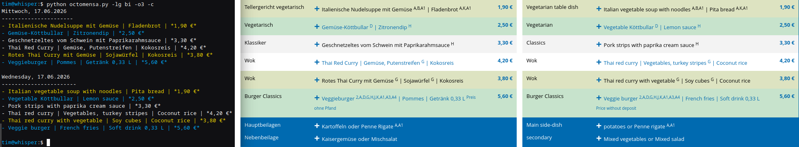

# OctoMensa - What's on the Menu?

Your favorite command-line tool for finding out what's on the menu at all of Aachen's finest dining places



## Usage Examples

Print today's menu at Mensa Academica (empty if there is no offer today):
```
python octomensa.py -m acad
```

Color the output to highlight vegetarian and vegan dishes:
```
python octomensa.py -m acad -c
```

Print the next menu (offset = 1) together with the menu afterwards (future = 1):
```
python octomensa.py -m acad -o1 -f1
```

Print today's menu in German, filtered for vegetarian dishes only:
```
python octomensa.py -m acad -lg de -v
```

Make a screenshot of the previous query as it is seen on the website:
```
python octomensa.py -m acad -lg de -v -s
```

Add differently colored backgrounds for vegetarian and vegan dishes in the screenshot:
```
python octomensa.py -m acad -lg de -v -s -c
```

Get today's menu as a bilingual screenshot, placing German and English side-by-side:
```
python octomensa.py -m acad -lg bi -s
```

Upload the result of the previous query into the channel with ID _1234_ on the configured Mattermost server:
```
python octomensa.py -m acad -lg bi -s -u 1234
```

Run the script in daemon mode, designed to generate the specified output every day at the specified time:
```
python octomensa.py -m acad -lg bi -s -u 1234 -d 08:00
```

Get the full description of all parameters as on the bottom of this page:
```
python octomensa.py -h
```


## Installation
The Python script requires a few packages as dependencies to be installed with `pip` as well as two tools available on the host machine for generating screenshots. To simplify the installation, a Docker container is provided in the repository. Change the last line of `Dockerfile` to match your desired options, and you are good to go.

If you want to go the manual route, the requirements are as follows:

### pip Packages
A full snapshot of the required packages is provided in `requirements.txt`. However, with a default installation of Python 3.14, it is sufficient to install:

```
pip install requests bs4 schedule selenium termcolor
```


### Host Packages
The host system requires the `firefox-esr` release to allow the creation of a virtual browser for taking screenshots, as well as the `montage` tool (part of ImageMagick) to stitch German and English screenshots together in bilingual mode. On a Debian-based system, for example, run:

```
sudo apt install firefox-esr imagemagick
```

If you do not plan to use the screenshot mode at all, you can skip these two requirements.

## Mattermost Connection

If you would like to upload the retrieved menu(s) to your Mattermost server (`-u` flag), perform the following steps:

 1. Provide the URL to your Mattermost server in the `mattermost_server_url` field in `src/Constants.py`
 2. Create a file `secret/mattermost-token.txt` relative to the root directory of the repository containing your personal API access token to be used for authentication
 3. Append `-u CHANNEL_ID` when running the script to upload the result to the provided channel instead of printing it on the terminal 

## Full Usage Help
```
usage: octomensa.py [-h] [-m {vita,acad,ahor,temp,baye,kmac,eupe,sued,juel}]
                    [-p [NUM_PAST]] [-f [NUM_FUTURE]] [-o NUM_OFFSET] [-v]
                    [-vv] [-l] [-c] [-lg {en,de,bi}] [-s] [-u UPLOAD]
                    [-d DAEMON_TIMESTRING]

OctoMensa: Your favorite command-line tool for finding out what's on the menu
at all of Aachen's finest dining places

options:
  -h, --help            show this help message and exit
  -m, --mensa {vita,acad,ahor,temp,baye,kmac,eupe,sued,juel}
                        the mensa to retrieve the menu for, default is 'vita'
  -p, --past [NUM_PAST]
                        print previous NUM_PAST menus, default is all
  -f, --future [NUM_FUTURE]
                        print next NUM_FUTURE menus, default is all
  -o, --offset NUM_OFFSET
                        offset the output by NUM_OFFSET menus, default is 0
  -v, --vegetarian      only show vegetarian options
  -vv, --vegan          only show vegan options
  -l, --long            use long instead of compact output, including dish
                        category
  -c, --color           use colored output, default is false
  -lg, --lang {en,de,bi}
                        select the language to retrieve, default is 'en'
  -s, --screenshot      save a screenshot of each selected menu
  -u, --upload UPLOAD   upload the result to Mattermost, takes the channel ID
                        as parameter
  -d, --daemon DAEMON_TIMESTRING
                        run as daemon to retrieve plan every day at the given
                        clock time string, e.g., 08:00

Available locations are Mensa Vita (vita), Mensa Academica (acad), Mensa
Ahornstraße (ahor), Bistro Templergraben (temp), Mensa Bayernallee (baye),
Mensa KMAC (kmac), Mensa Eupener Straße (eupe), Mensa Südpark (sued), Mensa
Jülich (juel)

```

## License
This software is provided under the MIT license, see `LICENSE.txt`.